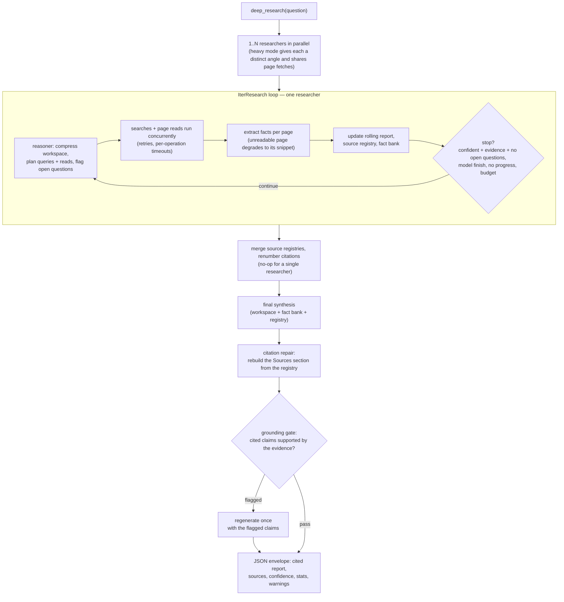

# Deep Research

[](LICENSE)
[](https://docs.mindroom.chat/plugins/)


A long-horizon web-research tool for [MindRoom](https://github.com/mindroom-ai/mindroom) agents, powered by the agent's own configured model.

Ask one hard question and get back a cited report.
`deep_research` runs a bounded, multi-round research loop — search, read, extract, decide, repeat — that compresses what it has learned into a rolling report between rounds so it can dig deep without blowing the context window.
The core loop and heavy mode port the IterResearch and Research-Synthesis patterns from [Alibaba's Tongyi DeepResearch](https://github.com/Alibaba-NLP/DeepResearch); the quality and robustness layers — the grounding gate, evidence-gated stopping, fail-soft degradation at every step, and role-based model routing — adapt techniques from [Lunon Deep Research](https://github.com/LunonAI/lunon-deep-research) (#1 on DeepResearch Bench).
Both are rebuilt onto MindRoom's existing model and tools instead of wrapping a dedicated research model, so it runs on whatever model the calling agent already uses (e.g. Vertex Claude) with no GPU and no extra services.

## Features

- Single `deep_research(question)` tool that returns a cited Markdown report as a JSON envelope
- Runs the loop on the caller's active MindRoom model — provider-agnostic, no model bundled
- Heavy mode (`parallel_researchers`): up to 4 independent research loops explore the question from different angles concurrently, then one synthesis pass integrates their cited reports over a merged source registry (Tongyi DeepResearch's Research-Synthesis pattern)
- Role-based model routing: `extract_model` sends the high-volume page-extraction role to a cheaper model while reasoning and synthesis stay on the strong one
- Reuses MindRoom's existing tools: a configurable search tool (Serper by default) and the native website reader
- Optional extra search channels (`search_channels`): named evidence backends — an internal wiki, enterprise document index, chat-history search — that the reasoner queries by setting a query's `kind`, with graceful degradation when a channel is unavailable
- Rolling summarize-and-replace report keeps long runs inside the context budget
- Append-only per-source fact bank, so extracted facts survive compression and feed final synthesis
- Stable `[n]` citations backed by a verified source registry that is the single source of truth
- Hard wall-clock deadline bounds every step, plus per-operation timeouts and transparent retries for search/read
- Final synthesis gets its own reserved slice of the wall clock (search rounds stop early to leave it), and `stopped_reason: "synthesis_truncated"` flags the rare case where the report itself was cut short
- Searches and page reads run concurrently within a round (bounded concurrency)
- Duplicate queries and already-fetched URLs are skipped across rounds, and the reasoner is told what was already tried
- In heavy mode, page fetches and extractions are shared across researchers, so parallel researchers converging on the same URL cost one fetch and one extraction instead of N
- A page that cannot be read (e.g. a 403 anti-bot response) degrades to its search snippet as a clearly-labeled unvetted source instead of vanishing from the evidence pool
- The reasoner can promote snippet-backed candidates into citable unvetted sources (`cite_snippet_urls`) without spending a page read — corroborating coverage the reasoner relies on no longer ends up uncited — and is nudged to spend its reads on primary sources
- Confidence-based stopping is evidence-gated (requires at least one registered source and no open questions the reasoner itself still flags), plus no-progress stopping
- The reasoner's open questions feed back into each round and any still unresolved at the end are surfaced in the final report as explicit unknowns
- A grounding gate verifies the final report's cited claims against the evidence it was written from and regenerates once on failure — fail-soft in every direction (skipped near the deadline, unparseable verdict passes, a regeneration that loses citations is discarded)
- A transiently failing reasoner call skips the round instead of ending the run
- Streams per-round progress into the thread, or runs quietly on request
- Pure plugin: no core changes and no plugin-local dependencies

## How It Works



1. An agent calls `deep_research(question)` in a thread.
2. The plugin resolves the caller's active model and builds an ephemeral, tool-less reasoning agent.
3. Each round: the reasoner plans searches and/or page reads (both may run in the same round), which execute concurrently with retries and per-operation timeouts; extracted facts are folded into a rolling report with stable citations and banked per source.
4. Between rounds the report is compressed (summarize-and-replace) so context stays bounded; the fact bank preserves evidence the compression drops.
5. The loop stops on high evidence-backed confidence, on no further progress, or when the round/wall-clock budget runs out.
   Repeated queries and re-reads are skipped so a looping model cannot burn budget.
6. A final synthesis pass sees the compressed report, the fact bank, and the source registry; the `## Sources` section is rebuilt from the registry using only citations that actually appear in the body.

## Agent Tools

| Tool | Purpose |
|------|---------|
| `deep_research(question, max_rounds=100, wall_clock_seconds=9000, model=None, verbosity="progress", max_queries_per_round=5, results_per_query=10, max_reads_per_round=10, page_char_limit=150000, report_token_cap=16000, parallel_researchers=1, extract_model=None, grounding=True, ground_model=None)` | Run a bounded, cited web-research loop for one question and return a JSON report envelope |

The returned envelope includes `status`, `report` (Markdown with `[n]` citations), `sources`, `confidence`, `rounds_used`, `stopped_reason`, `elapsed_seconds`, any `warnings`, and `stats` (counts of searches, reads, extractions, retries skipped as duplicates, and failures).
`stopped_reason` is one of `confident`, `model_finished`, `no_progress`, `max_rounds`, `wall_clock`, or `synthesis_truncated` — only the last one means the final report itself was cut short; every other reason still ends with a fully synthesized report.

Parameters:

- `question` — the research question (required, non-empty).
- `max_rounds` — soft round budget (default `100`, mirroring Tongyi DeepResearch's default LLM-call budget as this loop's round cap).
- `wall_clock_seconds` — hard time budget (default `9000`, matching Tongyi DeepResearch's 150-minute timeout).
- `model` — override the model name; defaults to the caller's active model.
- `verbosity` — `"progress"` streams per-round updates into the thread; `"silent"` returns only the final report.
- `max_queries_per_round` — maximum planned search queries per search round (default `5`, capped at `10`).
- `results_per_query` — search results fetched per query (default `10`, capped at `30`; Serper accepts larger `num` values, the cap keeps candidate lists within prompt budget).
- `max_reads_per_round` — maximum URLs read in one read round (default `10`, capped at `20`).
- `page_char_limit` — maximum page text passed to extraction (default `150000` chars, capped at `600000`).
- `report_token_cap` — approximate rolling report token budget (default `16000`, capped at `64000`).
- `parallel_researchers` — heavy mode: number of independent research loops run concurrently on different angles before one integrating synthesis (default `1`, capped at `4`; roughly multiplies token cost).
- `extract_model` — route page extraction to a different (typically cheaper) configured model; defaults to the run's main model.
- `grounding` — run the final grounding gate (default `true`); set `false` to skip it on quick bounded runs and save one or two LLM calls.
- `ground_model` — run the grounding check on a different configured model than the writer (a separate checker decorrelates verification from generation); defaults to the run's main model.

## Configuration

`deep_research` uses whatever model the calling agent is configured with, and reuses a MindRoom search tool plus the native website reader.
By default it uses the built-in Serper tool — make sure it has an API key configured before enabling this plugin.

### Custom search backends

Any registered MindRoom tool (built-in or from another plugin) can serve as the search backend.
Configure it on the tool entry:

```yaml
agents:
  researcher:
    tools:
      - deep_research:
          search_tool: my_search      # registered tool name (default: serper)
          search_function: search     # function used for every query kind
```

- `search_tool` — name of the registered tool to resolve for searches.
  If the calling agent's config also carries an entry for that tool (e.g. with project or API settings), those settings are reused when the search tool is built.
- `search_function` — a single function on that tool, called as `fn(query)` (a `num_results` keyword is passed only when the function accepts one).
  All query kinds (web/news/scholar) route to it.
  Leave unset for Serper's `search_web`/`search_news`/`search_scholar` routing.

The search function must return JSON.
Both Serper-style payloads (`organic`/`news`/`scholar` rows with `link`/`title`/`snippet`) and generic shapes (top-level lists, or `results`/`sources`/`items`/`documents` rows with `url`/`uri`/`permalink`, `title`, and `snippet`/`description`/`context`/`text`/`domain`) are understood; payloads with `error` or `status: "error"` are surfaced as search failures.

### Extra search channels

Beyond the default web backend, the reasoner can be given additional evidence backends — an internal wiki, an enterprise document index, a chat-history search — as named channels.
Each channel maps a name (which the reasoner uses as a query `kind`) to a registered MindRoom tool and function:

```yaml
agents:
  researcher:
    tools:
      - deep_research:
          search_tool: my_search
          search_function: search
          search_channels:
            - name: wiki
              description: Internal documentation and runbooks
              tool: my_wiki_tool
              function: search_documents
            - name: chat
              description: Team chat history
              tool: my_chat_search
              function: search_messages
```

- The reasoner sees each channel's name and description in its planning prompt and picks the fitting channel per query; unknown kinds fall back to the web channel.
- Channel functions are called like the main search function (`fn(query)`, with `num_results` only when accepted) and must return JSON in one of the shapes above — rows need a URL (or permalink) to enter the source registry.
- Channel tools are resolved with the calling agent's authored overrides for that tool, like the main search backend, and with the calling agent's worker target — so OAuth-backed MCP channels use the requester's own connection (per-user sessions) instead of an unscoped session that is never signed in.
  An unavailable channel is dropped for the run and reported in the result's `warnings` instead of failing the research.
- Channel names `web`, `news`, and `scholar` are reserved for the main backend.
- Functions that take structured keyword arguments instead of a single query string — MCP tools in particular, including the `<prefix>_call_tool` bridge of OAuth-backed MCP servers — can be called through an `arguments` template with `{query}` and `{num_results}` placeholders.
  A string that is exactly one placeholder keeps the substituted value's type (so `"{num_results}"` becomes an integer):

  ```yaml
  - name: wiki
    description: Internal documentation wiki
    tool: mcp_my_wiki
    function: my_wiki_call_tool
    arguments:
      tool_name: search_documents
      arguments:
        query: "{query}"
        limit: "{num_results}"
  ```

  MCP-style result objects are unwrapped (`.content`) before parsing, and functions registered in a toolkit's `async_functions` (as MCP toolkits do) are found alongside plain `functions`.
- Internal URLs that the native website reader cannot fetch degrade to their search snippet as unvetted sources, and the reasoner can cite snippet-backed channel hits directly via `cite_snippet_urls` — so channels remain useful even when their pages are not readable.
- UIs that only accept strings can use the compact form `"wiki=my_wiki_tool.search_documents|Internal documentation"`.
- **Per-agent overrides must use JSON object strings**: MindRoom validates per-agent `string[]` overrides as lists of strings (and hands them to the tool comma-joined), so structured channels on an agent's tool entry are authored as JSON strings of the same shape:

  ```yaml
  - deep_research:
      search_channels:
        - '{"name": "wiki", "description": "Internal documentation wiki", "tool": "my_wiki_tool", "function": "search_documents"}'
        - '{"name": "chat", "description": "Team chat history", "tool": "my_chat_search", "function": "search_messages", "arguments": {"tool_name": "search", "arguments": {"query": "{query}"}}}'
  ```

  Plain YAML mappings remain supported wherever config reaches the tool unconverted (global tool config, direct construction).

## Setup

1. Copy this plugin to `~/.mindroom/plugins/deep-research`.
2. Add the plugin to `config.yaml`:
   ```yaml
   plugins:
     - path: plugins/deep-research
   ```
3. Add `deep_research` to the agent's tools list.
4. Restart MindRoom.

## Prior Art

The design borrows deliberately from two open research systems:

- [Tongyi DeepResearch](https://github.com/Alibaba-NLP/DeepResearch) (Alibaba) — the IterResearch round structure (plan → act → compress into a rolling workspace), the round/wall-clock budgets, and heavy mode's Research-Synthesis pattern of parallel researchers integrated by one synthesis pass.
- [Lunon Deep Research](https://github.com/LunonAI/lunon-deep-research) (Lunon) — the layered fail-soft philosophy (every enhancement step degrades to the previous good state instead of failing the run), the grounding gate that verifies cited claims against evidence and regenerates once, verified-not-trusted stopping, snippet-level fallback evidence, and multi-model role routing.

Techniques from both were rescaled to fit a single chat-invoked tool; their heavier machinery (dedicated research models, per-section writing pipelines, benchmark-specific post-processing) was intentionally left out.
